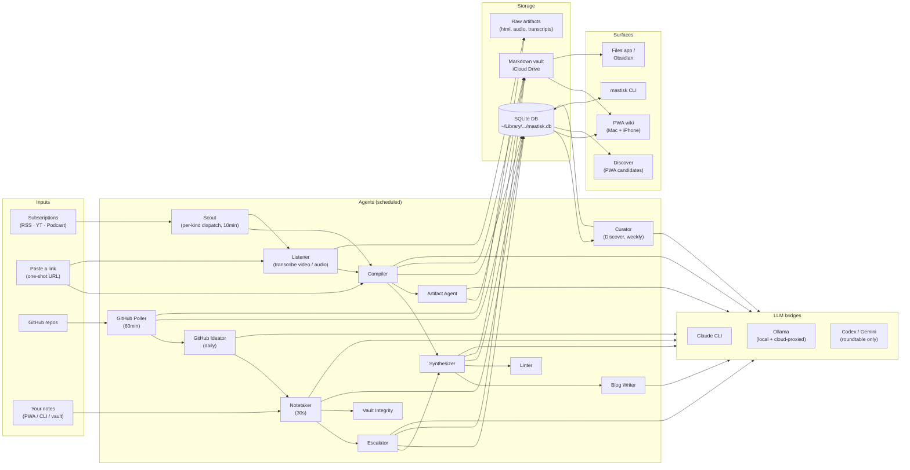
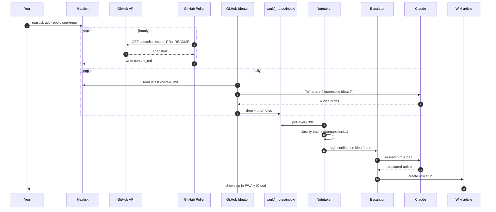

# Mastisk

> A personal knowledge wiki with 24/7 research agents.
> Runs locally on your Mac. Uses your Claude Code subscription + Ollama. Syncs the vault via iCloud. Installs as a PWA on your phone via Tailscale.

Mastisk is the assistant that **reads, watches, listens, and thinks for you in the background** — then hands you a wiki you actually wrote together. RSS, YouTube, podcasts, your notes, and the GitHub repos you care about all flow through a small fleet of agents that turn raw input into linked, cited, opinionated articles.

---

## Table of contents

- [What you get](#what-you-get)
- [How it works (architecture)](#how-it-works-architecture)
- [The agents](#the-agents)
- [How an idea is born (end-to-end flow)](#how-an-idea-is-born-end-to-end-flow)
- [Install (one command)](#install-one-command)
- [Prerequisites](#prerequisites)
- [Configuration](#configuration)
- [Running it](#running-it)
- [Phone setup](#phone-setup)
- [Subscriptions](#subscriptions)
- [Discover](#discover)
- [Connecting your GitHub](#connecting-your-github)
- [Capturing notes](#capturing-notes)
- [Multi-LLM roundtable](#multi-llm-roundtable)
- [Shape what the agents produce](#shape-what-the-agents-produce)
- [CLI reference](#cli-reference)
- [What lives where](#what-lives-where)
- [Uninstall](#uninstall)

---

## What you get

| capability | what it does |
|---|---|
| **Subscriptions** | One unified subscribe flow for RSS, YouTube channels/playlists, and podcasts. Paste any URL — the resolver auto-detects kind (Apple Podcasts → underlying RSS, YouTube `@handle` → channel feed) and runs recurring polling with diff tracking, force-poll, pause/resume, and per-source interest-filter override. |
| **Discover** | Weekly Curator agent surfaces high-quality sources *outside* your subscriptions via four signals: co-citation across your wiki, Substack recommendations from your existing subs, HN front-page domain leaderboard, and arXiv citation graph. Each card shows its trust path ("cited by Lilian Weng + 2 others") so you know *why* it surfaced. |
| **One-shot link saving** | Drop any URL — blog post, YouTube video, podcast episode, direct audio — into the "Paste a link" form. Backend auto-classifies: blogs go to Compiler (extract + article), audio/video go to Listener (transcribe + article). |
| **Notes** | Capture from PWA, CLI, or any editor. Auto-classified (`idea`, `question`, `task`, `quote`…). |
| **Auto-escalation** | High-value notes (ideas, questions) get researched by Claude into wiki-article stubs without you asking. |
| **GitHub repo tracking** | Hourly poll of commits, issues, PRs, README. Daily idea generation per repo. Local repos supported too. |
| **Multi-LLM roundtable** | Fan a prompt out to Claude / Codex / Gemini / Ollama in parallel. Get a synthesis paragraph that calls out where they agree and disagree. |
| **Knowledge graph** | Force-directed graph of your concepts and entities, with backlinks and a digest ranker. |
| **Synthesis pages** | Cross-article essays drafted by a Draft → Critic loop, refreshed as new sources land. |
| **Blog drafts** | "Personal blog post" first-person drafts assembled from your recent synthesis. |
| **Visual artifacts** | Diagrams + charts auto-generated for articles by a heavy local model. |
| **Vault editor in Settings** | Edit your `_self/*.md` identity files (`identity`, `interests`, `dislikes`, `style`, `learnings`) directly in the PWA. Atomic write to iCloud. |
| **Markdown vault** | Everything is also plain markdown in iCloud Drive. Open it in Obsidian, vim, the Files app, anything. |
| **PWA on your phone** | Installable, offline-friendly, full-screen. Read on the bus. |

Everything is **local-first**: your wiki lives in your iCloud Drive, your DB lives in `~/Library`, your secrets never leave your Mac.

---

## How it works (architecture)

Mastisk is a single Python process running on your Mac. It exposes a FastAPI app on `localhost:8080` (and your Tailnet hostname) and runs a scheduler that ticks each agent on its own cadence. Subscriptions (RSS / YouTube / Podcast), one-shot URL ingest, GitHub repos, your notes, and a weekly Discover loop all flow into a small fleet of agents that process inputs through Claude (via the `claude` CLI) and Ollama (local + cloud-proxied); outputs land in a SQLite DB **and** a markdown vault in iCloud.



**Key ideas:**

- **Agents are independent and small.** Each one is ~150–600 lines of Python with a single responsibility. They communicate through a `jobs` queue in SQLite.
- **Two LLM tiers, two budgets.** Cheap local Ollama for classification and embeddings; Claude for "actually think about this" work. Each agent has a daily cap so a runaway loop can't burn your Claude quota overnight.
- **The vault is the truth.** Articles, notes, synthesis pages, repo snapshots — all are markdown in iCloud. The DB is an *index*; you can wipe it and rebuild from the vault.
- **No API keys for Claude.** Mastisk shells out to the `claude` CLI, which uses your existing Claude Code session. You never paste an Anthropic key.

---

## The agents

| agent | trigger | what it does |
|---|---|---|
| **Scout** | every 10 min | Polls all enabled subscriptions (RSS, YouTube, podcast). Per-kind dispatch: RSS → Compiler (with interest-filter gating); YouTube → Listener `transcribe`; Podcast → Listener `transcribe_audio`. Diff-tracked via per-subscription `last_seen_guid`; first poll backfills N most-recent items. |
| **Listener** | per-job (Subscriptions feed Listener for YT/podcast; ad-hoc via Paste-a-link or `add-youtube`/`add-podcast`) | Downloads audio with `yt-dlp` (curl_cffi browser-impersonation TLS to dodge bot detection; 8s throttle between calls); transcribes with `mlx-whisper` if installed (falls back to subtitle scrape when available). Hands transcript to Compiler. |
| **Compiler** | per-job | Turns one source into a structured wiki article (title, summary, sections, related links, confidence) via Claude. Writes to DB + vault. |
| **Synthesizer** | periodic | Drafts cross-article Synthesis pages with a Draft → Critic loop. Refreshes when new related articles land. |
| **Notetaker** | every 30s | Watches `vault/_notes/inbox/`. When a new file is stable for 30s, classifies it locally (Ollama) into idea / question / task / quote / etc. |
| **Escalator** | per-classified-note | If a note is an idea or question with high confidence and enough length, kicks off Claude research. Output: a wiki-article stub linked from the note. |
| **GitHub Poller** | every 60 min | For each tracked repo: pulls commits, open issues, open PRs, and README via the GitHub API. Builds a `context_md` snapshot. |
| **GitHub Ideator** | daily per repo | Reads the latest `context_md` and generates ~4 idea-notes per repo per day. Each idea flows back through the Notetaker → Escalator pipeline. |
| **Blog Writer** | on demand | Drafts a personal blog post in your style from recent synthesis pages. |
| **Artifact Agent** | per article | Generates 1–3 visual artifacts (diagrams, charts) per article via a heavy local model. |
| **Curator** | weekly (configurable: weekly / daily) | Surfaces sources outside your subscriptions. Runs four signals in parallel — co-citation across your wiki, Substack `/recommendations` from each Substack subscription, HN front-page domain leaderboard (last 30 days), arXiv citation graph (Semantic Scholar). Merges by URL, applies confluence threshold + dislikes/blocklist filters, optional Claude relevance pass. Surfaces top-15 in the Discover view. |
| **Linter** | hourly | Health checks: dead links, stale stubs, articles with too-low confidence, etc. |
| **Vault Integrity** | hourly | Tombstones notes whose vault file was deleted from outside Mastisk (e.g. you cleaned up in Obsidian). |
| **Roundtable** | on demand | Fans a prompt to Claude / Codex / Gemini / Ollama in parallel and synthesizes. |

---

## How an idea is born (end-to-end flow)

This is the GitHub-repo-driven path — it's the densest demonstration of how the pieces compose. Each numbered step is a real subsystem you can poke at.



In plain English:

1. You run `mastisk add-repo anthropics/claude-code`. The repo gets registered in the DB.
2. Once an hour, the **GitHub Poller** asks the GitHub API for that repo's commits, open issues, open PRs, and README. It assembles a markdown snapshot called `context_md`.
3. Once a day per repo, the **GitHub Ideator** reads the latest `context_md`, asks Claude *"given this repo's recent activity, what are four interesting ideas to explore?"*, and writes the four answers as note files into `vault/_notes/inbox/`.
4. The **Notetaker** is watching that inbox. Every 30 seconds it scans for new files; when one is stable, it sends the text to Ollama and gets back a classification (`idea` / `question` / `task` / `quote` / …).
5. If the note is classified as an `idea` or `question` *with high confidence and enough length*, the **Escalator** picks it up.
6. The Escalator hands it to Claude with a research prompt. Claude returns a structured article (title, summary, sections, citations).
7. That article lands in your wiki — both the SQLite DB **and** as markdown in your iCloud vault. It's now reachable in the PWA, in the Files app, and in Obsidian.
8. Later, the **Synthesizer** may pull this article into a cross-article Synthesis page if it sees enough related material. The **Linter** keeps an eye on dead links and low-confidence stubs.

The same pattern works for RSS (`Scout` instead of `GitHub Poller/Ideator`) and YouTube/podcasts (`Listener`). Notes you write yourself ride the same Notetaker → Escalator pipe.

---

## Install (one command)

```bash
git clone <this-repo> ~/Code/mastisk
cd ~/Code/mastisk
./install.sh --autostart
```

That's it. `install.sh` checks prereqs, builds the frontend, installs the Python package via `uv tool`, pulls an embed model, initializes config + iCloud vault, enables launch-at-login, and prints your phone URL.

Want the demo wiki (Test-time compute + friends) so you can see what a populated install looks like?

```bash
./install.sh --autostart --demo
```

Update to the latest code (git pull + rebuild + reinstall + restart):

```bash
mastisk update            # works from anywhere once installed
mastisk update --check    # show pending commits without applying
# or equivalently:
./install.sh --update     # same thing, script form
```

Uninstall (preserves your iCloud vault):

```bash
./install.sh --uninstall
```

---

## Prerequisites

| tool | install | required? | why |
|---|---|---|---|
| **uv** | `curl -LsSf https://astral.sh/uv/install.sh \| sh` | yes | isolated Python tool install |
| **node** | `brew install node` | yes | builds the frontend once |
| **claude** | [claude.com/claude-code](https://claude.com/claude-code) + `claude login` | yes | agents use your Claude subscription |
| **ollama** | `brew install ollama` | optional but recommended | local + cloud-proxied models, embeddings |
| **tailscale** | `brew install --cask tailscale` or App Store | optional | phone access from anywhere |
| **mlx-whisper** | `uv tool install --force --reinstall --with mlx-whisper .` | optional | only needed for transcribing YouTube videos / podcast episodes that lack subtitles |
| **codex / gemini** CLIs | per-tool docs | optional | only needed if you want them in roundtables |

`install.sh` verifies these and tells you which are missing. (`curl_cffi` is pulled in automatically — it gives `yt-dlp` browser-fingerprint TLS so YouTube doesn't rate-limit your IP.)

---

## Configuration

### Where things live

| what | where | format | required? |
|---|---|---|---|
| **Claude auth** | managed by `claude` CLI | — | required; run `claude login` |
| **Ollama Cloud API key** | `config.toml` → `ollama_cloud_key` | string | optional; skip to use local Ollama only |
| **GitHub PAT** | `config.toml` → `[github] pat` (or PWA → Settings → GitHub) | classic PAT, `public_repo` scope | optional but recommended |
| **Tailscale auth** | Tailscale app (menu-bar icon) | — | optional; only if you want phone access |
| **Subscriptions** | SQLite `subscriptions` table (managed via PWA → Subscriptions or `mastisk subscribe`) | URL list (kind auto-detected) | needed for Scout to do anything |
| **Discover blocklist** | SQLite `discovery_blocklist` table (managed via PWA → Settings → Discovery) | domain list | optional; per-domain "never surface" list |
| **iCloud sync** | macOS Settings → Apple ID → iCloud → iCloud Drive → on | — | required for phone-side vault access |

`config.toml` lives at `~/Library/Application Support/Mastisk/config.toml`. It's the only place secrets are stored on disk, and it's locked to mode `0600`.

### Setting the Ollama Cloud key

Three ways:

```bash
# 1. At install time (prompts interactively)
mastisk init

# 2. Non-interactively
mastisk init --ollama-key sk-xxx

# 3. Edit directly later (the file is human-readable)
open ~/Library/Application\ Support/Mastisk/config.toml
```

**Tip:** if you've already done `ollama signin` in the Ollama desktop app, your local Ollama transparently proxies `:cloud`-tagged models. In that case you don't strictly need to put the cloud API key into Mastisk's config.

### Setting the GitHub PAT

Three ways:

```bash
# 1. PWA → Settings → GitHub → paste PAT (validates against the API)
# 2. Edit ~/Library/Application Support/Mastisk/config.toml under [github]
# 3. export MASTISK_GITHUB_PAT=ghp_xxx   (env var override)
```

A classic PAT with `public_repo` scope gets you 5,000 GitHub API requests/hour. Without one you're limited to 60/hour, which the Poller will hit fast.

### Per-agent budgets and models

`config.toml` also holds:

- daily budget caps per agent (`[budget]`) — hard limits on how many jobs each agent runs per day
- model selection (`embed_model`, `summarize_model_heavy`, `summarize_model_cheap`)
- subsystem-specific config blocks: `[notes]`, `[roundtable]`, `[github]`, `[blog]`, `[discover]`

Safe to edit. Mastisk reloads config on the next agent tick — no restart needed.

### Discovery settings

The Curator agent (Discover) uses these defaults; override in `config.toml` under `[discover]` or in **PWA → Settings → Discovery**:

```toml
[discover]
cadence_hours = 168       # 168 = weekly (default), 24 = daily
min_confluence = 2        # min distinct trusted-source endorsements before surfacing (1 = off, 2, 3)
llm_judge_enabled = true  # Claude relevance pass on the survivor set (1 call/cycle)
```

### What you do *not* need a key for

- **Anthropic API key** — not needed. Mastisk uses the `claude` CLI subprocess.
- **YouTube / podcast keys** — not needed. `yt-dlp` works against public content without auth.

---

## Running it

```bash
mastisk start    # foreground, Ctrl-C to stop
```

### Auto-start on login

Enable it once:

```bash
mastisk enable-autostart
```

This installs `~/Library/LaunchAgents/com.mastisk.agents.plist` with `RunAtLoad=true`, so Mastisk starts whenever you log in. **By design it does NOT auto-restart on crash** — that's deliberate, to prevent a runaway loop burning your Claude quota. If Mastisk quits mid-session, log out and log back in, or:

```bash
launchctl kickstart gui/$(id -u)/com.mastisk.agents    # start it right now
launchctl kill SIGTERM gui/$(id -u)/com.mastisk.agents # stop it
```

Disable auto-start:

```bash
mastisk disable-autostart
```

Logs:

```bash
tail -f ~/Library/Application\ Support/Mastisk/logs/mastisk.log
```

---

## Phone setup

1. Install the **Tailscale** app on your phone, sign in to the same tailnet as your Mac.
2. On your Mac: `mastisk url` — copy the Tailnet line (`http://<hostname>.tailXXXXX.ts.net:8080`).
3. Open that URL in Safari on your phone.
4. Tap the Share icon → **Add to Home Screen**.

You now have a Mastisk icon that launches full-screen. It's a PWA — works offline for cached articles, syncs when you're back online.

You also get a **second reading path** via iCloud: **Files app → iCloud Drive → Mastisk → vault → `*.md`**. Plain markdown, opens in Obsidian too. The PWA is the rich UX; the iCloud vault is the fallback when your Mac is off.

---

## Subscriptions

Subscriptions is the single home for everything the agents poll on a schedule — RSS feeds, YouTube channels and playlists, podcast shows. **Paste any URL once**, and Mastisk handles the rest: detecting the kind, polling on cadence, diff-tracking new items, and dispatching them to the right agent.

```bash
# Subscribe via CLI (any URL works — auto-detects the kind):
mastisk subscribe https://www.youtube.com/@mkbhd
mastisk subscribe https://podcasts.apple.com/us/podcast/.../id1674008350
mastisk subscribe https://simonwillison.net/atom/everything/

# List + manage:
mastisk subscriptions
mastisk poll-now <url>          # force-poll right now
mastisk unsubscribe <url>
```

Or in the PWA: sidebar → **◈ Subscriptions** → `+ Add subscription` → paste URL. The modal probes the URL live and shows the detected kind + title before you commit:

> ✓ YouTube · Marques Brownlee · 1,247 items

### What gets auto-detected

| input | resolved to | dispatched to |
|---|---|---|
| YouTube channel URL or `@handle` | `feeds/videos.xml?channel_id=UC...` | Listener (transcribe each new video) |
| YouTube playlist URL | `feeds/videos.xml?playlist_id=PL...` | Listener |
| Apple Podcasts URL (`podcasts.apple.com/.../idNNN`) | iTunes Lookup → underlying RSS | Listener (transcribe_audio) |
| Podcast RSS feed | (kept as-is) | Listener |
| Plain RSS / Atom feed | (kept as-is) | Compiler (interest-filter applies) |
| Spotify URL | (rejected — DRM) | n/a |
| `news.ycombinator.com` | use `https://hnrss.org/frontpage?points=100` directly — see below | Compiler |

### Hacker News

HN itself doesn't have an official front-page RSS. The third-party `hnrss.org` does, with a points filter that gives you a clean "reached front page" signal:

```bash
mastisk subscribe 'https://hnrss.org/frontpage?points=100'
```

≥100 points reliably means a story climbed to and stayed on the HN front page. Your `interests.md` filter then narrows the ~50 daily candidates to your topics.

### Per-subscription controls

When you subscribe, you can configure:

- **Backfill** — number of recent items to process on the first poll (default 3)
- **Bypass interest filter** — default ON for YouTube / Podcast (you subscribed → you want it), OFF for RSS (interests gate still applies)

After subscribing, the detail page (click any row in Subscriptions) lets you:

- **Poll now** — force a fetch immediately
- **Pause / Resume** — stop polling without removing
- **Edit title** — inline (✎)
- **Remove** — stop polling and drop the subscription
- **Recent items** — see the last 20 jobs the subscription kicked off, with status badges

### One-shot links (Paste a link)

Below the subscriptions list, there's a "Paste a link" form for **one-off** ingestion. Drop any URL — blog post, YouTube video, podcast episode, direct audio — and the system auto-classifies and processes it once (no recurring polling). Same form, three classes of input:

```bash
# Blog post → Compiler
# YouTube video → Listener (transcribe)
# Podcast episode / direct audio → Listener (transcribe_audio)
```

Already-saved URLs return a friendly "already saved · &lt;title&gt;" without re-processing.

---

## Discover

Subscriptions deepen your wiki within the sources you've chosen. **Discover widens it** — surfacing high-quality sources outside your subscriptions that you should know about, but using only your existing trust network as the validation signal. Every recommendation comes with a verifiable trust path back to people you already endorse.

The system never says "this is good." It says **"Karpathy and Lilian Weng both link here, you've never read it."**

### Four signals (all run in parallel each cycle)

| signal | what it computes |
|---|---|
| **Co-citation** | External URLs/domains cited by ≥N of your wiki articles. Pure DB query. The strongest signal — your trusted writers already vouched for these. |
| **Substack recommendations** | For each Substack subscription, scrapes its `/recommendations` page. Publications recommended by ≥2 of your subs surface as candidates. The writers themselves are vouching. |
| **HN domain leaderboard** | Domains that repeatedly hit the HN front page (last 30 days), filtered to ones you don't already follow. Community curation as the filter. |
| **arXiv citation graph** | For each arXiv paper in your wiki sources, walks references via Semantic Scholar. Papers cited by ≥N of your wiki articles surface as candidates. |

A final **Claude relevance pass** (ON by default) scores the top ~15 finalists 1–10; survivors with score ≥7 are kept. One Claude call per cycle. Toggle off in Settings if you don't want it.

### Cadence + threshold

Curator runs **weekly** by default. Override in PWA → Settings → Discovery (or `mastisk discover-now` to force a cycle):

| setting | default | options |
|---|---|---|
| Cadence | Weekly | Daily / Weekly |
| Confluence threshold | 2 | Off (≥1) · 2 · 3 |
| LLM judge | On | toggle |

### What you do with a discovery

Each card in the Discover view lists up to 3 trust-path snippets ("cited by …", "recommended by …", "hit HN N× last 30d", "referenced from …") and four ghost-button actions:

- **Subscribe** — adds it as a real recurring Subscription (via the Subscriptions resolver, so the kind gets re-detected)
- **Save** — one-off ingest (same as Paste-a-link)
- **Dismiss** — drops the card without affecting future surfacing of the same source
- **Block domain** — never surface this domain again. One-click with an undo toast for 5s.

Blocked domains are managed in **Settings → Discovery → Blocked domains**.

### When will I see results?

Discover needs material to find patterns in. With a fresh wiki and ~5 subscriptions, expect the first useful surfacing 1–2 weeks in. With 20+ subscriptions and a few months of ingestion, the weekly cycle typically produces 5–15 high-confidence candidates per run.

If your wiki is small and you want results sooner, drop the confluence threshold to `Off (≥1)` temporarily, run `mastisk discover-now`, evaluate the surfacing, then move it back to `2`.

---

## Connecting your GitHub

Track GitHub repositories and Mastisk will poll them hourly (commits + open issues + open PRs + README) and generate fresh idea-notes per repo per day. Those ideas flow through the normal Notes pipeline — they get classified, auto-escalated if interesting, and you can run the Roundtable on any of them.

```bash
# 1. Add a PAT (one-time, classic with public_repo scope)
#    PWA → Settings → GitHub → paste it
#    or:
#    edit ~/Library/Application Support/Mastisk/config.toml under [github]

# 2. Add a repo
mastisk add-repo anthropics/claude-code

# 3. Wait. The Poller picks it up within an hour; the Ideator runs daily.
#    Or check the queue right now:
mastisk logs -n 50

# 4. List + remove
mastisk list-repos
mastisk remove-repo anthropics/claude-code   # tombstones; snapshots + notes are kept
```

You can also add a repo from the PWA: sidebar → **Repos** → "+ add repo".

Configure cadence in `config.toml` under `[github]`:

```toml
[github]
pat = "ghp_..."                # or set MASTISK_GITHUB_PAT env var
poll_interval_minutes = 60     # how often to refresh context_md
ideate_tick_minutes = 60       # how often the Ideator wakes up
ideate_min_interval_hours = 24 # min hours between ideation runs per repo
ideas_per_run = 4              # how many ideas to generate per run
ideate_model = "claude-sonnet-4-6"
```

### Local repos

You can also point Mastisk at a checkout on your Mac (any git directory). The local-git bridge respects `.gitignore` and a built-in secrets blocklist (`.env`, `*.pem`, `node_modules/`, etc.) so private contents stay private.

---

## Capturing notes

Three ways, any combination:

- **PWA:** click the `+` in the titlebar, type, ⌘↵ to save.
- **CLI:** `mastisk note "a quick thought"` or `mastisk note` (opens `$EDITOR`).
- **Any editor:** drop a `.md` file into `vault/_notes/inbox/` — Obsidian, Files app, vim, an iOS Shortcut to Files, etc.

Classified notes land in `vault/_notes/YYYY-MM-DD/` with YAML frontmatter. Notes tagged as `idea` or `question` can auto-escalate to wiki article stubs (configurable in `config.toml → [notes]`).

---

## Multi-LLM roundtable

Fan any prompt out to Claude, Codex, Gemini, and Ollama in parallel. Get a synthesis paragraph that summarizes where they agree, disagree, and who's hallucinating.

Three ways:

- **PWA:** open a note → click `roundtable` → wait ~30s → synthesis appears → optionally save it as a note.
- **CLI:** `mastisk roundtable "a prompt"` (or `--note 42` / `--article slug`).
- **Any editor:** not supported — the roundtable is a transient research artifact, not user-authored content.

Configure backends, timeouts, and per-backend models in `config.toml` under `[roundtable]`. A missing CLI (e.g. `gemini` not installed) is skipped silently; results are stored with `error='backend not available'`.

Saved roundtables live in the **Roundtables** sidebar entry. Each perspective is kept in full so you can compare side-by-side.

---

## Shape what the agents produce

Agents load `vault/_self/*.md` into every prompt. Edit these files — on your Mac OR your phone via iCloud Drive — to steer the wiki.

```
vault/_self/
├─ identity.md      who you are, role, expertise
├─ interests.md     topics Scout should track (embedding similarity gate)
├─ dislikes.md      topics to filter out (substring match on title+summary)
├─ style.md         how you want content written
└─ learnings.md     auto-appended by the Reflection agent (M2)
```

Three ways to edit them:

- **PWA → Settings → Vault files** — edit any of the five files inline, save back to iCloud atomically. Easiest path.
- **Open the folder on Mac:** `open ~/Library/Mobile\ Documents/com~apple~CloudDocs/Mastisk/vault/_self`
- **Edit on your phone** via the Files app → iCloud Drive → Mastisk → vault → _self

Changes apply on the next agent run — no restart needed.

### Bootstrap content

From a clean state, several ways to give the agents something to do:

```bash
# Subscribe to a recurring source — RSS / YouTube / podcast (auto-detected)
mastisk subscribe https://simonwillison.net/atom/everything/
mastisk subscribe https://www.youtube.com/@mkbhd
mastisk subscribe 'https://hnrss.org/frontpage?points=100'

# One-off ingest a single URL (blog / video / podcast episode)
#   — paste it in the PWA's "Paste a link" form, or:
mastisk add-youtube https://www.youtube.com/watch?v=...
mastisk add-podcast https://example.com/podcast-episode.mp3

# Track a GitHub repo (recurring)
mastisk add-repo anthropics/claude-code

# Force a Discover cycle (instead of waiting a week)
mastisk discover-now

# Or load the sample wiki
mastisk seed-demo
```

Watch the agents work:

```bash
mastisk logs -n 50    # tail the feed ticker
mastisk status        # full content + agents + bridges report
```

---

## CLI reference

```
mastisk doctor              check preconditions
mastisk status              full content + agents + bridges report
mastisk status --ping       same, plus live Claude + Ollama smoke test
mastisk update              git pull + rebuild + reinstall + restart
mastisk update --check      show pending commits without applying
mastisk init                first-time setup (empty DB)
mastisk init --demo         first-time setup + seed the demo wiki
mastisk seed-demo           load the demo wiki onto an existing install
mastisk reset               wipe wiki content (keeps identity + config + feeds)
mastisk reset --wipe-vault  wipe markdown vault too
mastisk start               run the app (foreground)
mastisk dev                 dev mode with reload (repo-checkout only)
mastisk url                 print Desktop + LAN + Tailnet URLs

# Subscriptions (RSS / YouTube / Podcast — kind auto-detected)
mastisk subscribe <url>     subscribe to RSS / YouTube / podcast
mastisk subscriptions       list all subscriptions
mastisk unsubscribe <url>   remove a subscription
mastisk poll-now <url>      force-poll a single subscription
mastisk add-feed <url>      alias of `subscribe` (back-compat)

# One-off / ad-hoc ingest
mastisk add-youtube <url>   queue a video for Listener
mastisk add-podcast <url>   queue a podcast (RSS / Apple / direct audio)

# Discover (Curator)
mastisk discover-now        run a Curator (Discover) cycle immediately

# Notes + Roundtable
mastisk note [text]         capture a note (opens $EDITOR if no text)
mastisk roundtable [text]   fan a prompt out to all LLM backends + synthesize

# GitHub repos
mastisk add-repo <slug>     track a GitHub repo (hourly poll + daily ideation)
mastisk list-repos          list tracked repos
mastisk remove-repo <slug>  tombstone a tracked repo

# Ops
mastisk logs                tail agent activity
mastisk vault-path          show where the vault lives
mastisk backup              tar the DB + config to ./mastisk-backup-*.tar.gz
mastisk enable-autostart    install launchd agent (opt-in)
mastisk disable-autostart   remove launchd agent
```

---

## What lives where

| kind | path | synced? |
|---|---|---|
| Python package + venv | `~/.local/share/uv/tools/mastisk/` | no |
| CLI binary | `~/.local/bin/mastisk` | no |
| Config (with secrets) | `~/Library/Application Support/Mastisk/config.toml` | no |
| SQLite DB | `~/Library/Application Support/Mastisk/mastisk.db` | no (iCloud would corrupt live writes) |
| Raw artifacts (html, audio, transcripts) | `~/Library/Application Support/Mastisk/raw/` | no |
| Logs | `~/Library/Application Support/Mastisk/logs/` | no |
| Launchd plist (if autostart enabled) | `~/Library/LaunchAgents/com.mastisk.agents.plist` | no |
| **Markdown vault** | `~/Library/Mobile Documents/com~apple~CloudDocs/Mastisk/vault/` | **yes — iCloud** |

---

## Uninstall

```bash
./install.sh --uninstall
```

Equivalent to:

```bash
mastisk disable-autostart
uv tool uninstall mastisk
rm -rf ~/Library/Application\ Support/Mastisk
```

Your iCloud vault (the markdown) is preserved. Delete it manually if you want:

```bash
rm -rf ~/Library/Mobile\ Documents/com~apple~CloudDocs/Mastisk
```

---

## License

MIT. See `pyproject.toml`.
